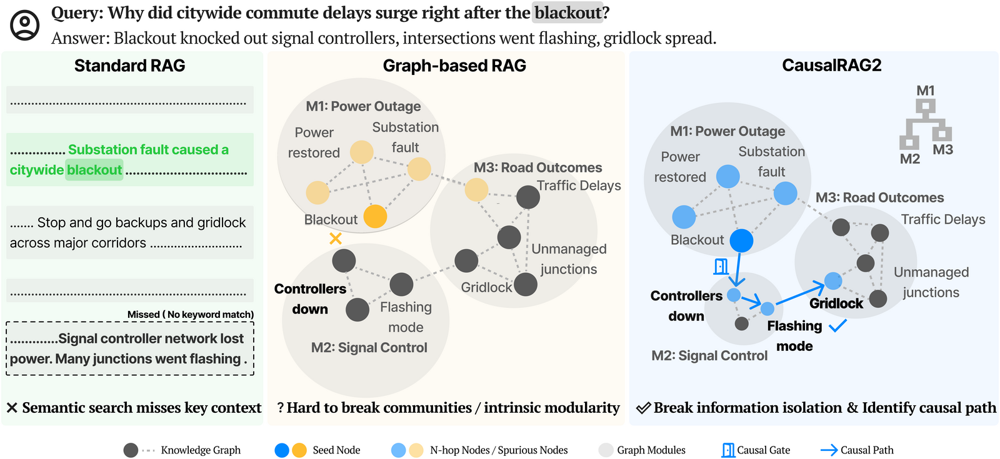
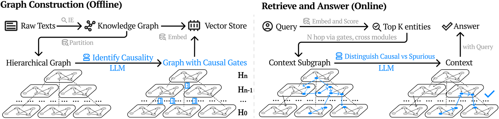
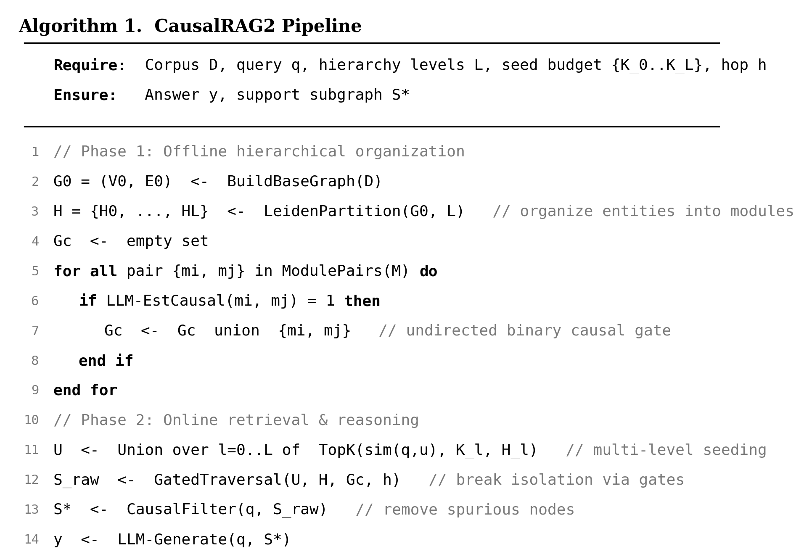

<h1 align="center">CausalRAG2</h1>

<p align="center">
  <b>Hierarchical Causal Gating Design for Knowledge Organization</b><br>
  ICML 2026
</p>

<p align="center">
  
  
</p>

## Why CausalRAG2

Graph-based RAG works well on traditional QA benchmarks, but largely by **matching
the right entity node** rather than understanding a document. CausalRAG2 targets the
two structural failures behind this:

- 🔗 **Breaks information isolation (recall).** Retrieval gets trapped inside dense
  graph modules and never reaches relevant but distant evidence. CausalRAG2 adds
  **causal gates**: sparse, LLM-verified links that bridge distant-but-causally-related
  modules across a hierarchy.
- 🎯 **Removes spurious noise (precision).** Semantic matching pulls in
  topically-similar but causally-irrelevant nodes. An online **causal filter** keeps
  only the nodes that lie on genuine causal paths.

> 📊 **We also release [HolisQA](#holisqa-a-benchmark-for-holistic-comprehension), a benchmark for what QA hides.**
> Standard QA rewards node matching; HolisQA evaluates **holistic comprehension** for
> RAG systems and agents, the regime where node matching breaks down.

## An example - CausalRAG2 and others

<p align="center">
  
</p>
<p align="center"><em>Standard RAG, Graph-based RAG, and CausalRAG2 on the same query.</em></p>

## How CausalRAG2 works

<p align="center">
  
</p>
<p align="center"><em>Offline: build a hierarchical graph and add causal gates. Online: seed across levels, traverse gates, filter spurious nodes, and answer.</em></p>

<p align="center">
  
</p>

Details: [docs/method.md](docs/method.md) (online retrieval and reasoning) and
[docs/graph_construction.md](docs/graph_construction.md) (offline graph builder).

## HolisQA: a benchmark for holistic comprehension

Popular QA datasets reward short, entity-centric answers, so a model can score
well by hitting the right node without assembling a supporting chain. **HolisQA**
is a benchmark for evaluating **holistic comprehension** in **RAG systems and LLM
agents**: each question requires integrating evidence across multiple sentences,
exposing the gap between node matching and genuine document understanding.

- **Five scientific domains** (biology, business, computer science, medicine,
  psychology), about 2,200 multi-sentence QA pairs. See
  [data/holisqa/](data/holisqa/README.md).
- **Reproducible and leakage-resistant.** We ship the construction scripts so you
  can rebuild it from the **latest** open-access papers on
  [OpenAlex](https://openalex.org) (the released split uses 2025 publications). Using fresh
  sources keeps answers out of an LLM's parametric memory, so the benchmark
  measures retrieval rather than memorization:

  ```bash
  python scripts/holisqa_1_download_openalex.py --per-category 1111 --year 2025
  python scripts/holisqa_2_generate_qa.py --runs 50 --qas-per-run 10
  ```

## Installation

```bash
git clone https://github.com/Pwnb/CausalRAG2.git
cd CausalRAG2
python -m venv .venv && source .venv/bin/activate

pip install -e .            # core
pip install -e ".[full]"    # optional: best graph quality + retrieval
pip install -e ".[data]"    # optional: only to rebuild HolisQA (scripts/holisqa_*.py)

cp .env.example .env        # then add your OPENAI_API_KEY
```

## Quickstart: text → causal-gated graph → QA

`build_graph` constructs the **hierarchical graph with causal gates** (entities →
modules via Leiden → causal gates via LLM verification); `run_single` then seeds
across levels, traverses the gates, filters spurious nodes, and answers.

```python
from causalrag2 import build_graph, run_single

text = """
Sleep deprivation raises the stress hormone cortisol. Elevated cortisol
increases blood pressure and promotes inflammation, which damages blood
vessels and accelerates arterial plaque buildup.
"""

graph = build_graph(text, out_root="runs/demo")          # build the causal-gated graph
result = run_single({"question": "How can poor sleep harm the heart?"}, str(graph))
print(result["answer"])
```

> **Note:** the passage above is a tiny toy example. CausalRAG2 is designed for
> large corpora (the paper builds graphs over corpora of up to ~2.8M characters),
> where the hierarchy and causal gates matter most.

Run the bundled example with `python examples/quickstart.py`, or build from your
own corpus:

```bash
python -m causalrag2.indexer path/to/corpus.txt runs/my_graph --model gpt-5-nano
```

## Repository layout

```
causalrag2/
  indexer.py        offline builder: extraction, hierarchy, causal gates
  core.py           the method: run_single (seeding + gated traversal + causal filter + answer)
  graph_utils.py    community detection + embeddings (with fallbacks)
  prompts.py        all five paper prompts (IE, causal gate, rerank, answer)
examples/quickstart.py
data/holisqa/        the HolisQA dataset (5 domains)
scripts/             HolisQA construction (OpenAlex download + QA generation)
tests/test_pipeline.py   offline end-to-end smoke test (no API key needed)
docs/
```

## Citation

```bibtex
@inproceedings{wang2026causalrag2,
  title     = {CausalRAG2: Hierarchical Causal Knowledge Graph Design for RAG},
  author    = {Wang, Nengbo and Liang, Tuo and Singh, Vikash and Song, Chaoda and
               Yang, Van and Yin, Yu and Ma, Jing and Singh, Jagdip and Chaudhary, Vipin},
  booktitle = {Proceedings of the 43rd International Conference on Machine Learning (ICML)},
  year      = {2026},
  url       = {https://github.com/Pwnb/CausalRAG2}
}
```

CausalRAG2 builds on its predecessor, **CausalRAG**
([github.com/Pwnb/CausalRAG](https://github.com/Pwnb/CausalRAG), Findings of ACL 2025):

```bibtex
@inproceedings{wang2025causalrag,
  title     = {CausalRAG: Integrating Causal Graphs into Retrieval-Augmented Generation},
  author    = {Wang, Nengbo and Han, Xiaotian and Singh, Jagdip and Ma, Jing and Chaudhary, Vipin},
  booktitle = {Findings of the Association for Computational Linguistics: ACL 2025},
  pages     = {22680--22693},
  year      = {2025},
  url       = {https://github.com/Pwnb/CausalRAG}
}
```

## License

Released under the [MIT License](LICENSE).
